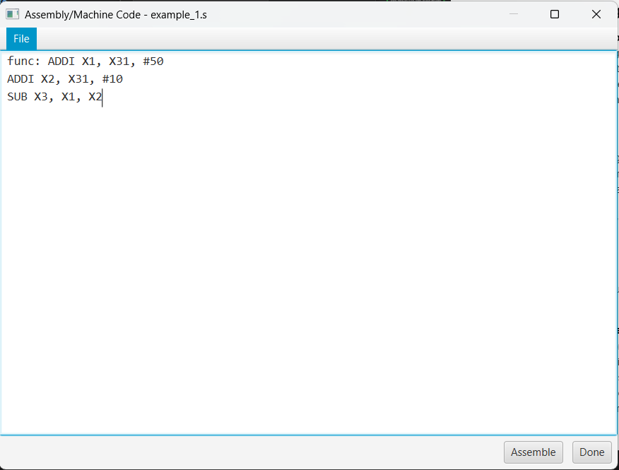
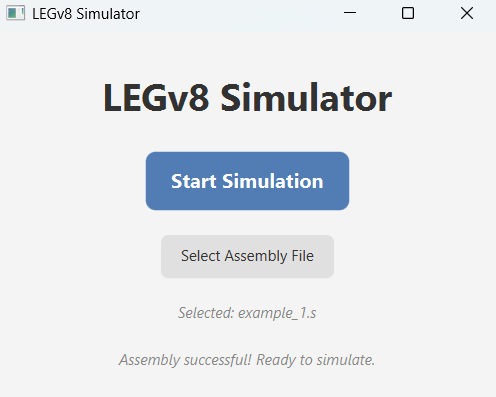
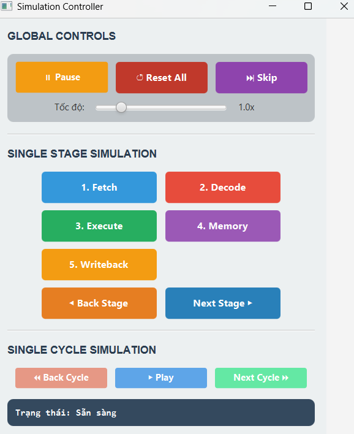
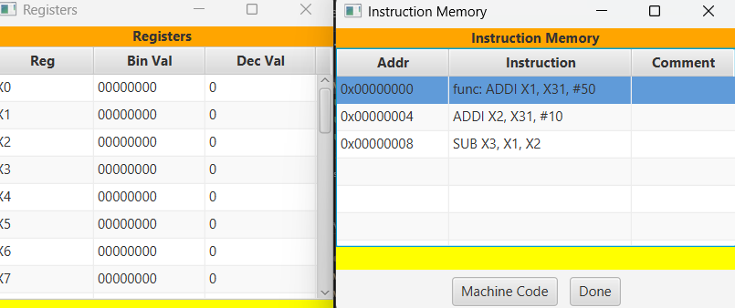
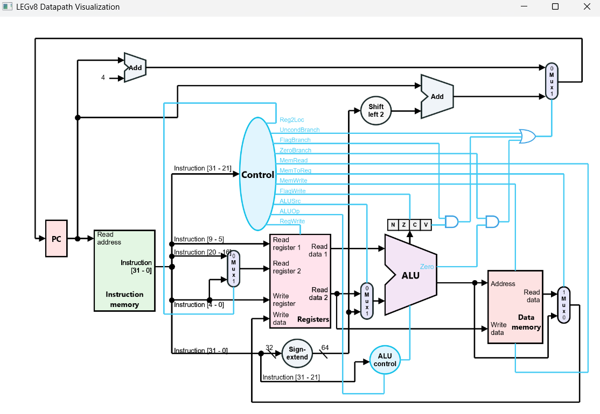

# LEGv8-FX-Simulator

A robust and interactive LEGv8 instruction set simulator developed using Java and JavaFX. This project provides a user-friendly graphical interface to visualize the execution of LEGv8 assembly code, offering real-time insights into CPU operations, register states, and memory contents.

## Overview

The LEGv8-FX-Simulator is designed for educational and development purposes, enabling users to write, assemble, and execute LEGv8 assembly programs while observing the internal workings of a CPU. The simulator features a dynamic interface with detailed visualizations of the CPU's datapath, registers, memory, and processor states, making it an excellent tool for learning and debugging LEGv8 assembly code.

## Features

- **Assembly Code Editor**: Write LEGv8 assembly code directly or load it from a `.txt` file.
- **Two-Pass Assembler**: Converts assembly instructions, registers, and labels into 32-bit machine code.
- **CPU State Visualization**:
  - **Register View**: Displays all 32 general-purpose registers (X0–X30, XZR) in decimal and hexadecimal formats.
  - **Instruction Memory**: Shows the loaded program with memory addresses, machine code, and corresponding assembly instructions.
  - **Data Memory**: Visualizes the contents of main memory (RAM) with address-value pairs.
  - **Processor State**: Tracks the Program Counter (PC) and PSTATE flags (N, Z, C, V).

## 🧭 Simulator Controls Overview
### 🔧 Global Control

- **Pause / Resume:** Temporarily pauses or resumes the simulation process.
- **Reset All:**  Resets the entire program and CPU state to the initial state after assembly (post-assembler).
- **Skip:** Allows selecting a specific line of code and skipping all prior execution steps to simulate from that line.

### 🧩 Single Stage Simulation
Simulates each **individual stage** of the pipeline for a single instruction:
- **Fetch**: Loads the instruction from instruction memory.  
- **Decode**: Decodes the instruction and reads operands.  
- **Execute**: Performs operations (e.g., arithmetic, logic) in the ALU.  
- **Memory**: Accesses data memory if required (load/store).  
- **Writeback**: Writes the result back to the destination register.  
- **Backstage**: Reverts to the previously executed stage for review.  
- **Next Stage**: Proceeds to the next stage in the instruction pipeline.

### 🔁 Single Cycle Simulation

Simulates each **full instruction cycle**, including all 5 stages:

- **Back Cycle:**  Reverts the CPU to the previous full instruction cycle (all 5 stages).

- **Play:**  Executes the program from start to finish until a `HALT` instruction is encountered.

- **Next Cycle:**  Executes the next instruction in full, including all 5 pipeline stages.


### 📊 Status Bar

Displays the current state of the simulator:

## Getting Started

This guide will help you get the LEGv8-FX-Simulator up and running on your local machine using Visual Studio Code.

### **Prerequisites**

Before you begin, ensure you have the following installed:

*   **Java Development Kit (JDK)**: **Version 11 or higher** is required.
*   **JavaFX SDK**: Make sure you have the JavaFX libraries. The project is configured to use them via Maven, but you may need to configure your IDE.
*   **Visual Studio Code**: With the [Extension Pack for Java](https://marketplace.visualstudio.com/items?itemName=vscjava.vscode-java-pack) installed.

### **Installation & Setup**

1.  **Clone the Repository**
    Open your terminal or command prompt and clone the project from GitHub:
    ```bash
    git clone https://github.com/<your-username>/LEGv8-FX-Simulator.git
    cd LEGv8-FX-Simulator
    ```

2.  **Open in VS Code**
    Open the cloned project folder in Visual Studio Code.

3.  **Configure VS Code Paths**
    For the JavaFX application to launch correctly from within VS Code, you need to update the paths in the `.vscode` directory:
    
    *   Open the `.vscode/launch.json` file.
    *   Locate the `vmArgs` property. You will need to modify the path in the `--module-path` argument to point to your local JavaFX SDK's `lib` folder.
        *Example `launch.json` modification:*
        ```json
        "vmArgs": "--module-path \"C:/path/to/your/javafx-sdk-17/lib\" --add-modules javafx.controls,javafx.fxml" 
        ```
    *   *(If necessary)* Open the `.vscode/settings.json` file and ensure the `java.project.referencedLibraries` path also points to your JavaFX `lib` folder.

4.  **Run the Simulator**
    Once the paths are configured, you can run the application directly from VS Code:
    *   Open the main application file: `src/main/java/com/yourcompany/legv8simulator/Main.java`.
    *   Press **F5** or click the "Run and Debug" button in the sidebar to launch the simulator.

You are now ready to load and execute LEGv8 assembly code

## Usage

### 1. Loading a Program



- Launch the simulator and you will see the main interface with a code editor and control buttons.
- Navigate to `File > Open` in the menu bar and select a `.txt` file containing LEGv8 assembly code or write your code directly in the editor.
- Click the **Assemble** button to convert the assembly code into machine code.
- The assembler will process the code, load it into the **Instruction Memory**, and reset registers and memory.

**Example Program (`program.txt`)**:
```arm-asm
// Simple program to add two numbers
ADDI X1, XZR, #10   // X1 = 10
ADDI X2, XZR, #20   // X2 = 20
ADD  X3, X1, X2     // X3 = X1 + X2
HALT                // End of program
```

### 2. Executing the Program


- After click **Done** button, the program will be loaded into the instruction memory.
- Click **Start Simulation** to begin executing the program.
- Use button in controller to do what you want 



### 3. Viewing Registers and Memory

- **Registers**: Displays all 32 registers with their current values in decimal and hexadecimal.
- **Instruction Memory**: Shows the loaded program with memory addresses, machine code, and corresponding assembly instructions + hightlighting the current instruction. Clicking on an instruction will highlight it in the code editor and press **Skip** to skip all previous instructions and run from the selected instruction.

- **Datapath**: Visualizes the flow of data and control signals through the CPU pipeline.


## 5. Demo 
you can see the demo of this project in this video: [Demo Video](https://drive.google.com/file/d/1-QwYJWye3K8FpRmXc4hvpUZGcoc7WQHO/view?usp=sharing)


## Contributing

Contributions are welcome! To contribute:

1. Fork the repository.
2. Create a new branch (`git checkout -b feature-branch`).
3. Make your changes and commit (`git commit -m "Add feature"`).
4. Push to the branch (`git push origin feature-branch`).
5. Open a Pull Request with a detailed description of your changes.

Please ensure your code follows the project's coding standards and includes appropriate tests.

## License

This project is licensed under the MIT License. See the [LICENSE](LICENSE) file for details.

## Acknowledgments

- Built with [JavaFX](https://openjfx.io/) for the graphical interface.
- Inspired by educational tools for computer architecture and assembly language learning.